# VoiceRankings Reader Architecture

This document provides a high-level overview of the architecture of the VoiceRankings Reader extension. Due to the complex nature of Chrome Extension development—especially regarding audio playback and cross-context communication—this guide is crucial for understanding how state flows through the system.

## The Three Realms

The extension operates across three distinct Chrome extension contexts:

1.  **Content Script (`js/content/`)**
    *   Injected directly into the host web page.
    *   **Responsibilities**: Rendering the `tts-widget` UI, highlighting text on the page (`readingMode.js`), parsing the DOM (`textTracking.js`), and handling user clicks.
    *   **Restrictions**: Cannot play background audio continuously, cannot make arbitrary cross-origin fetch requests easily.

2.  **Background Service Worker (`js/background/`)**
    *   Runs in the background, waking up to handle events.
    *   **Responsibilities**: Managing global state, routing messages between the UI and the offscreen document, handling TTS API requests (`voice.js`), and managing the Side Panel UI state (`sidepanel.js`).
    *   **Restrictions**: Has no DOM access. Cannot play audio at all (Chrome V3 restriction).

3.  **Offscreen Document (`off_screen.html` / `off_screen.js`)**
    *   A hidden HTML page that the background script creates when needed.
    *   **Responsibilities**: The *sole* purpose of this document is to play audio without interruption and send `timeupdate` events back to the background script.

---

## High-Level Sequence Diagram: Audio Playback

When a user selects text and clicks "Play", here is how the data flows through the system:

```mermaid
sequenceDiagram
    autonumber
    actor User
    participant Content as Content Script<br/>(TTSWidget & WordHighlighter)
    participant BG as Background<br/>(voice.js & ExternalVoicePlayer)
    participant API as TTS Provider API
    participant Offscreen as Offscreen Document

    User->>Content: Clicks "Play" on text
    Content->>BG: chrome.runtime.sendMessage<br/>(action: "playText")
    
    rect rgb(20, 20, 30)
        Note right of BG: AudioEngine & BufferManager
        BG->>API: Fetch TTS Audio Blob
        API-->>BG: Returns base64 / blob
    end
    
    BG->>Offscreen: chrome.runtime.sendMessage<br/>(action: "play-audio", audioUrl)
    Offscreen-->>Offscreen: HTML5 <audio> play()
    
    loop Every ~50ms during playback
        Offscreen->>BG: timeupdate (currentTime)
        BG->>Content: onTimeUpdateCallback(currentTime)
        Content->>Content: WordHighlighter advances span highlights
    end
    
    Offscreen->>BG: onEnded
    BG->>Content: onEndedCallback
```

---

## Core Module Breakdown

The core logic for managing speech playback resides in `js/components/speech/`. Specifically, `ExternalVoicePlayer.js` acts as an orchestrator that delegates responsibilities to the following sub-modules:

### 1. `AudioEngine.js`
Handles the low-level mechanics of audio playback. It is responsible for instructing the `offscreen` document to load and play audio blobs, and sets up the message listeners for `timeupdate` and `ended` events.

### 2. `BufferManager.js`
In charge of maintaining the playback queue. Since TTS generation can be slow, `BufferManager` proactively fetches the *next* sentence in the background while the current sentence is playing. It ensures gapless playback and handles discarding stale downloads if the user skips ahead.

### 3. `WordHighlighter.js`
Operates in the DOM context (Content Script). It maps the audio timestamps received from the TTS provider (or STT service like Deepgram) to the actual DOM text nodes. It uses an advanced **Lookahead Heuristic** and **Word Boundary matching** to perfectly sync the visual text highlight with the audio, gracefully ignoring mismatched or hallucinated words.

### 4. `SessionManager.js`
Manages the telemetry and lifecycle of a reading session. It tracks how long a user has been listening, how many characters have been processed, and safely flushes metrics to the backend.

### 5. `TimerManager.js`
Handles internal delays and synthetic timers, particularly useful when audio timestamps are missing or when rendering artificial delays between sentences.

---

## State Management

Because the UI (Content Script) and the audio logic (Background) are separated, state is synced via message passing. 

*   **UI State (`WidgetState.js`)**: Tracks whether the widget is open, collapsed, or loading.
*   **Playback State (`ExternalVoicePlayer.js`)**: The source of truth for what index is currently playing, what is buffered, and what Voice is selected. 

To change state from the UI (e.g., pausing playback), the Content Script must send a message to the Background, which then updates the orchestrator, stops the Offscreen audio, and optionally broadcasts a state change back to the UI.
